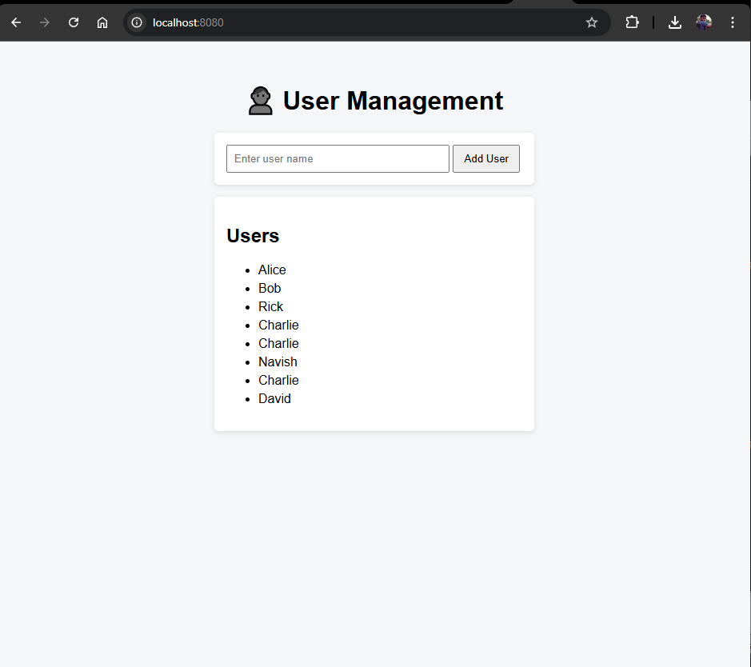

# FASTAPI KUBERNETES MICROSERVICE PROJECT – FULL SETUP GUIDE

---
### PROJECT OVERVIEW

This project is a FastAPI-based microservice deployed on Kubernetes (Minikube).
It includes:
- FastAPI backend with HTML + JS UI
- PostgreSQL database
- Kubernetes deployment using Helm
- Monitoring with Prometheus and Grafana (installed via Helm)
- Automation using .bat (Windows) and .sh (Linux/Mac) scripts

The goal is that an end user can run ONE script and the full system starts working.

---
### FOLDER STRUCTURE

main-app/
│
├── backend/
│   ├── main.py
│   ├── requirements.txt
│   ├── dockerfile
│   ├── static/
│   │   ├── app.js
│   │   └── styles.css
│   └── templates/
│       └── index.html
│
├── fastapi-app/
│   ├── Chart.yaml
│   ├── values.yaml
│   ├── charts/
│   └── templates/
│       ├── deployment.yaml
│       ├── service.yaml
│       ├── ingress.yaml
│       └── postgres.yaml
│
├── start.bat
├── start.sh
└── README.txt

---
### PREREQUISITES

- Docker installed and running
- Minikube installed
- Helm installed
- kubectl installed
- Internet access for Helm charts
- Add the following entry to your hosts file:

127.0.0.1 micro.local

---
### BACKEND DOCKERFILE (backend/Dockerfile)

FROM python:3.10-slim
WORKDIR /app
COPY requirements.txt .
RUN pip install --no-cache-dir -r requirements.txt
COPY . .
EXPOSE 80
CMD ["uvicorn", "main:app", "--host", "0.0.0.0", "--port", "80"]

---
### MONITORING STACK (PROMETHEUS + GRAFANA)

Prometheus and Grafana are installed using the official Helm chart:
kube-prometheus-stack

NO custom Helm charts are written for monitoring.
Everything is installed via Helm commands.

Grafana:
- Enabled
- Exposed using NodePort
- Port: 30000
- URL: http://localhost:30000

Prometheus:
- Enabled
- Uses ServiceMonitor to scrape FastAPI metrics

---
### WHY NOTHING TO COMMIT FOR PROMETHEUS/GRAFANA

Prometheus and Grafana were installed using Helm CLI commands.
Since no custom Helm charts were written:
- There is nothing to commit except documentation
- The setup is reproducible using scripts
- This is the recommended industry approach

---
### HOW TO RUN THE PROJECT

WINDOWS:
1. Open Command Prompt as Administrator
2. cd into main-app
3. Run: start.bat

LINUX / MAC:
1. Open terminal
2. cd into main-app
3. chmod +x start.sh
4. Run: ./start.sh

---
### APPLICATION ACCESS

FastAPI UI:
http://micro.local/

FastAPI API:
GET  /users
POST /users  { "name": "Alice" }

Grafana:
http://localhost:30000
Default user: admin
Default password: admin

---
### APP UI

---
### Grapahana Dashboard

---
### CLEANUP

helm uninstall fastapi-app -n fastapi-app
helm uninstall monitoring -n monitoring
minikube stop

---
END OF DOCUMENT
